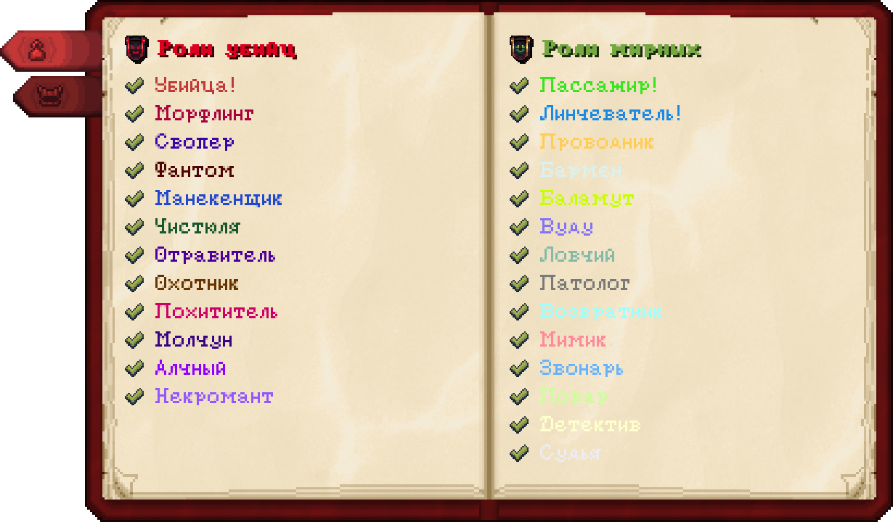
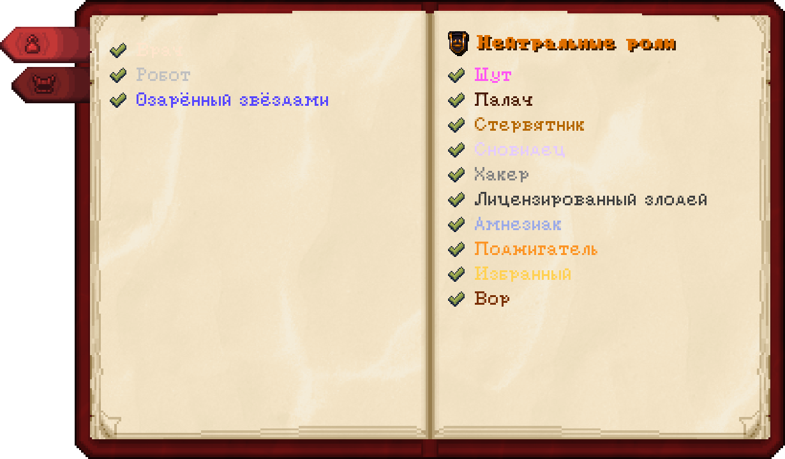
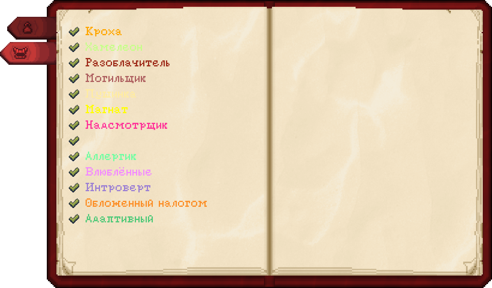
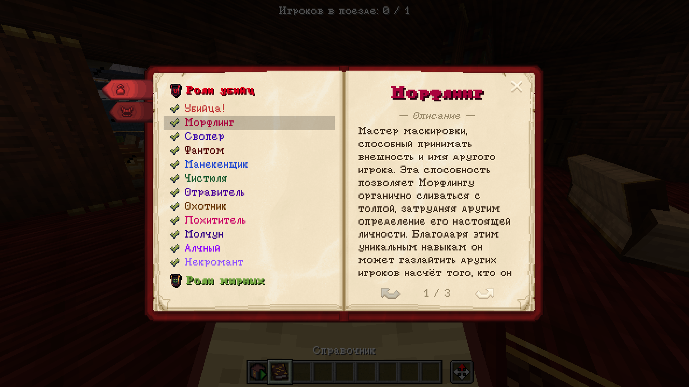
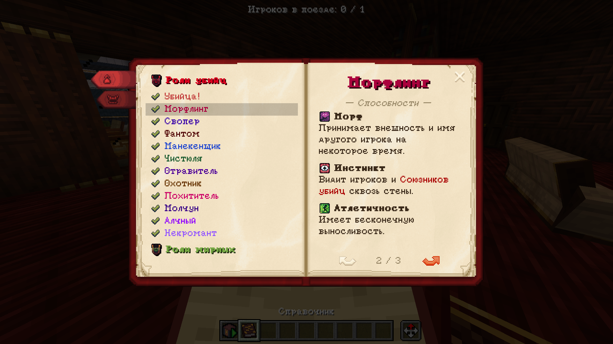
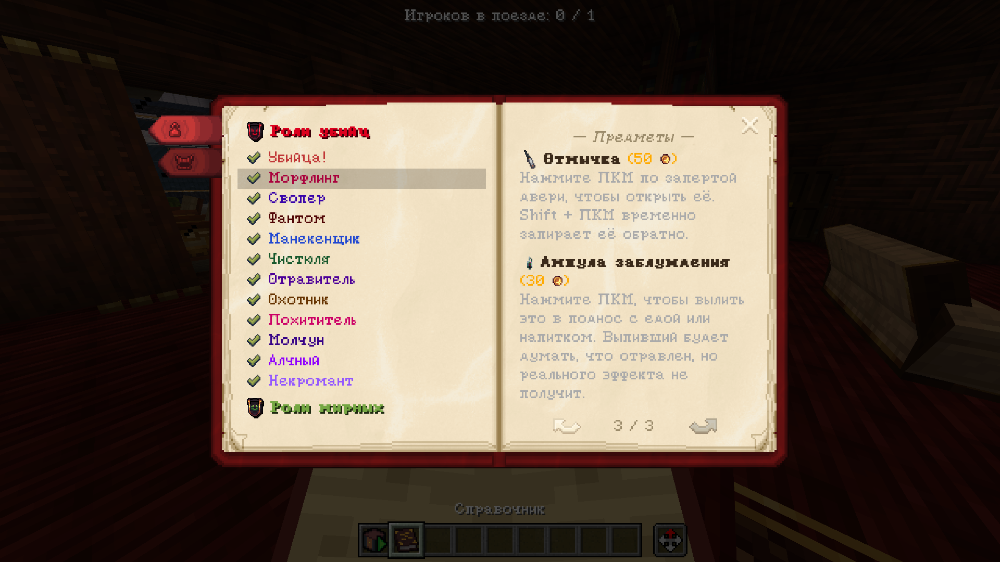
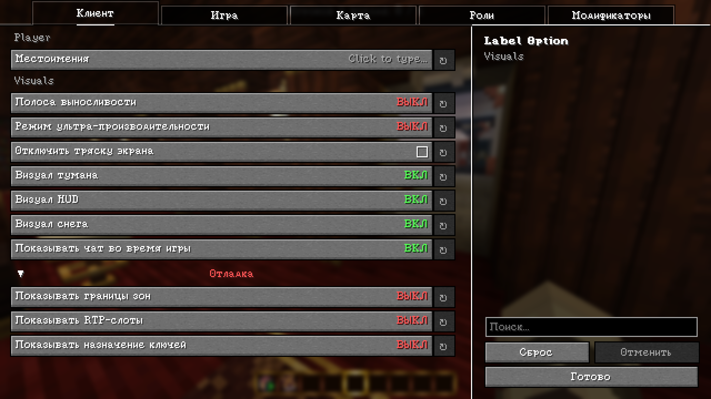

## EN:
This repository contains an unofficial Russian translation of the [The Harpy Express: Extended](https://modrinth.com/modpack/the-harpy-express-extended) modpack.

<details>
  <summary>Not exactly important, but...</summary>

<p>
  
  <span style="vertical-align: middle;">Fixes for the built-in translation of the <a href="https://modrinth.com/mod/wathe">Wathe</a> mod will not be applied until you complete the following steps:</span>
  </p>

1. Launch the modpack with [Resource Pack Overrides](https://modrinth.com/mod/resource-pack-overrides) and [YOSBR](https://modrinth.com/mod/yosbr) disabled.
2. Open the `Resource Packs...` menu and move the translation above the `Fabric Mods` entry.
3. Leave the menu, wait for the changes to be applied, and close Minecraft.
4. Open the `options.txt` file in `.minecraft`, copy the entire `resourcePacks` line, then replace the `resourcePacks` line in `.minecraft/config/yosbr/options.txt` with it.
5. Replace the `"default_packs"` line in `.minecraft/config/resourcepackoverrides.json` with this one, then enable those mods again:

```json
"default_packs": [
        "vanilla",
        "file/The Harpy Express: Extended - Russian translate v{Version}.zip",
        "fabric",
        "mod_resources",
        "moonlight:merged_pack",
        "file/-1.21.2 Fresh Moves v3.1 (No Animated Eyes).zip"
    ],
```
Replace `{Version}` with the version number of the stable resource pack release, for example `0.4` or `0.5`, or, if you are using the rolling release, replace the file name with `thee-rus-latest.zip`

</details>

There are several installation options available:

1. Install the Codeberg [rolling release](https://codeberg.org/Agent19872/thee-rus/raw/branch/rolling/thee-rus-latest.zip)
2. Install the [stable release](https://modrinth.com/resourcepack/thee-rus/versions) from Modrinth

## RU:
Этот репозиторий неофициального перевода сборки [The Harpy Express: Extended](https://modrinth.com/modpack/the-harpy-express-extended) на русский язык.

<details>
  <summary>Не совсем важно, но...</summary>

  <p>
  
  <span style="vertical-align: middle;">Исправления для встроенного перевода мода <a href="https://modrinth.com/mod/wathe">Wathe</a> не применятся, пока вы не выполните следующие действия:</span>
  </p>

1. Запустите сборку с отключёнными модами [Resource Pack Overrides](https://modrinth.com/mod/resource-pack-overrides) и [YOSBR](https://modrinth.com/mod/yosbr).
2. Зайдите в меню `Наборы ресурсов...` и поднимите перевод выше элемента `Моды Fabric`.
3. Выйдите из меню, дождитесь применения изменений и закройте Minecraft.
4. Откройте файл `options.txt` в `.minecraft`, полностью скопируйте строку `resourcePacks`, затем замените этой строкой строку `resourcePacks` в файле `.minecraft/config/yosbr/options.txt`.
5. Замените строку `"default_packs"` в файле `.minecraft/config/resourcepackoverrides.json` на эту, а затем снова включите эти моды:

```json
"default_packs": [
        "vanilla",
        "file/The Harpy Express: Extended - Russian translate v{Version}.zip",
        "fabric",
        "mod_resources",
        "moonlight:merged_pack",
        "file/-1.21.2 Fresh Moves v3.1 (No Animated Eyes).zip"
    ],
```

Вместо `{Version}` укажите номер версии стабильной версии ресурспака, например `0.4` или `0.5`, либо, если вы используете rolling release, замените имя файла на `thee-rus-latest.zip`.

</details>

Для установки доступно несколько вариантов:
1. Установить с Codeberg [rolling-релиз](https://codeberg.org/Agent19872/thee-rus/raw/branch/rolling/thee-rus-latest.zip)
2. Установить с Modrinth [стабильный релиз](https://modrinth.com/resourcepack/thee-rus/versions)

## Screenshots/Скриншоты:













