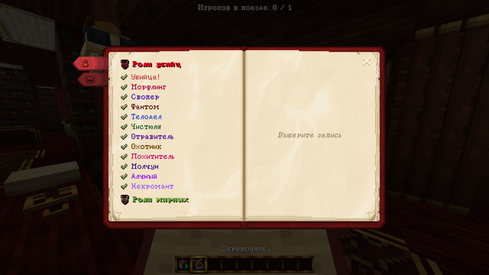
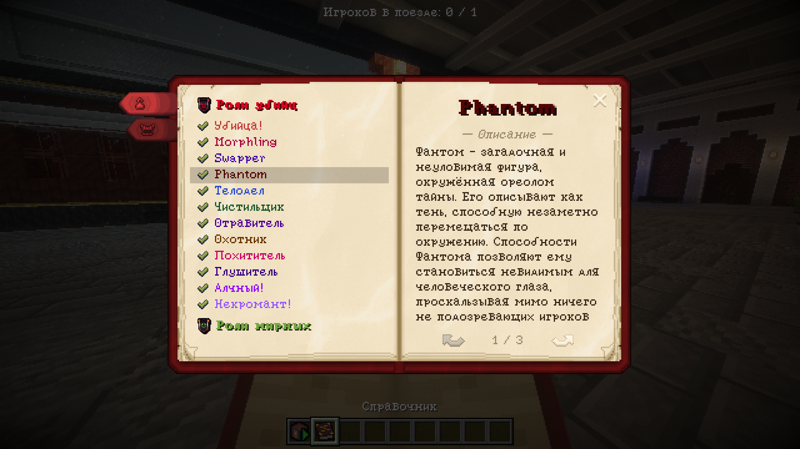
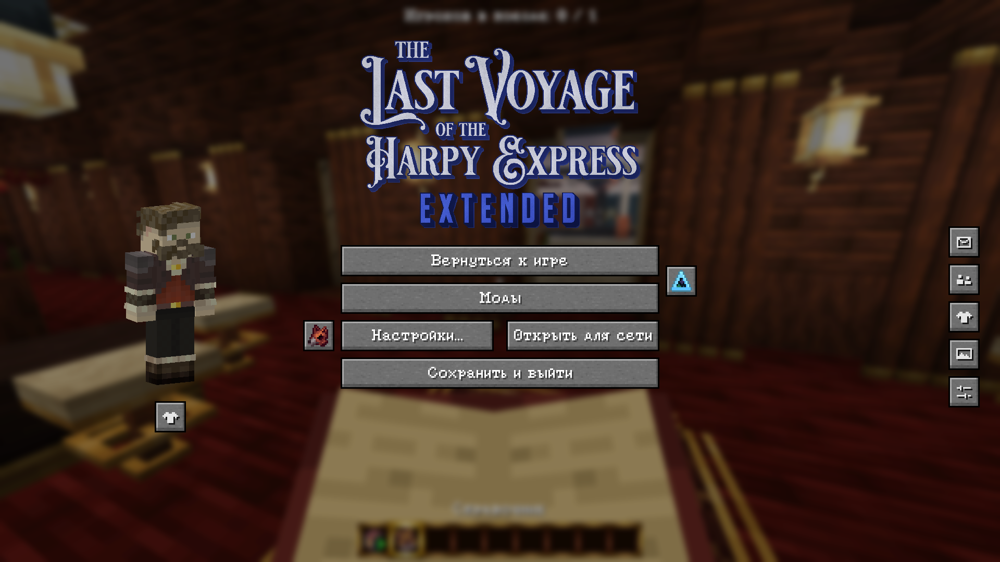
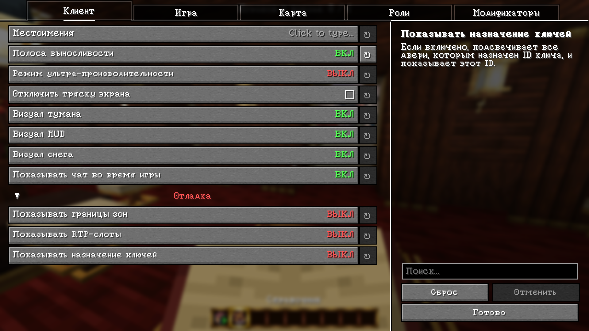

## EN:
This repository contains an unofficial Russian translation of the [The Harpy Express: Extended](https://modrinth.com/modpack/the-harpy-express-extended) modpack.

There are several installation options available:
1. Install the Codeberg [rolling release](https://codeberg.org/Agent19872/thee-rus/raw/branch/rolling/thee-rus-latest.zip)
2. Install the [stable release](https://modrinth.com/resourcepack/thee-rus/versions) from Modrinth

## RU:
Этот репозиторий неофициального перевода сборки [The Harpy Express: Extended](https://modrinth.com/modpack/the-harpy-express-extended) на русский язык.

Для установки доступно несколько вариантов:
1. Установить с Codeberg [rolling-релиз](https://codeberg.org/Agent19872/thee-rus/raw/branch/rolling/thee-rus-latest.zip)
2. Установить с Modrinth [стабильный релиз](https://modrinth.com/resourcepack/thee-rus/versions)

## Screenshots/Скриншоты:

